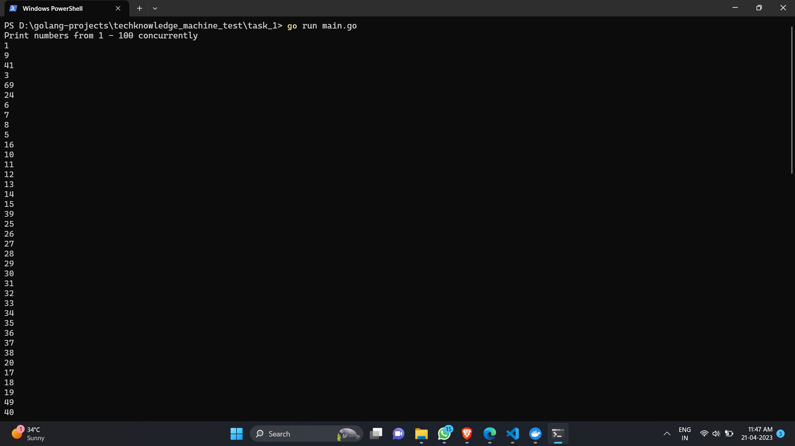

# Task - 1
A program that uses Go's concurrency features to print the numbers from 1 to 100 concurrently.

Used waitgroups to make the main goroutine wait for all the other go routine to finish.

## Outputs
  
