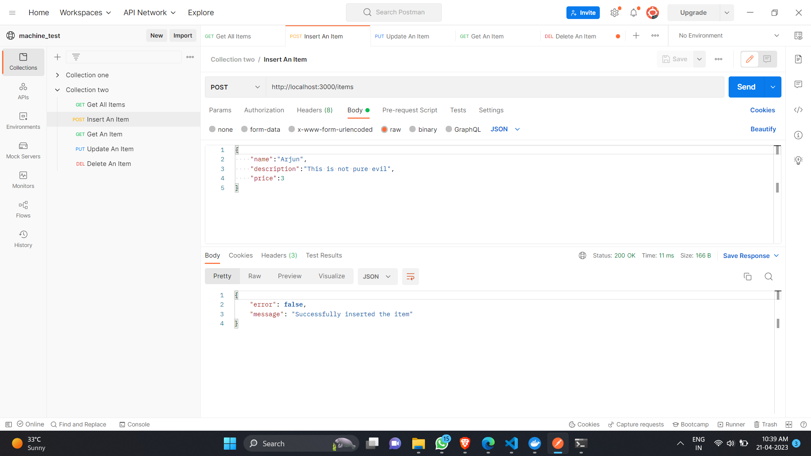
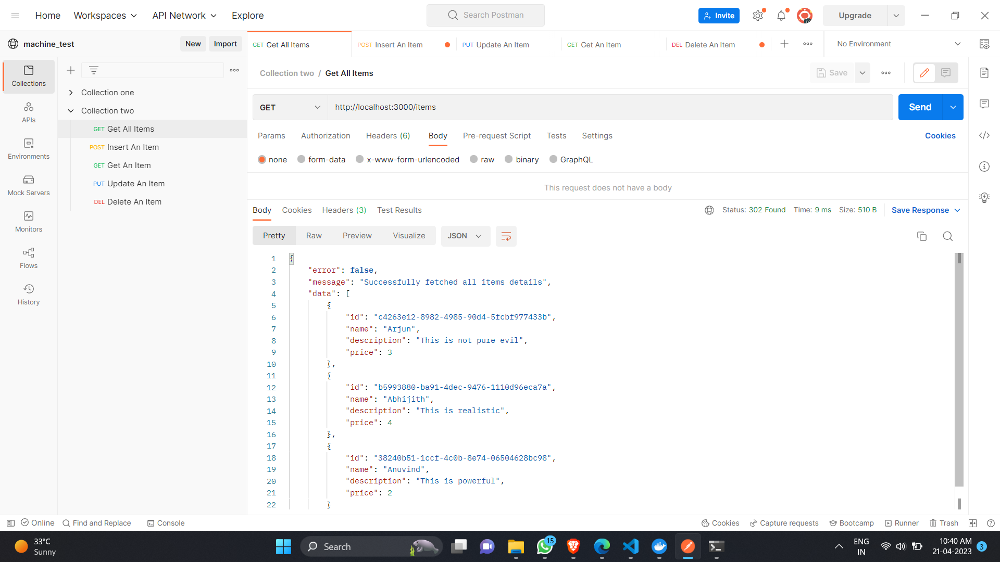
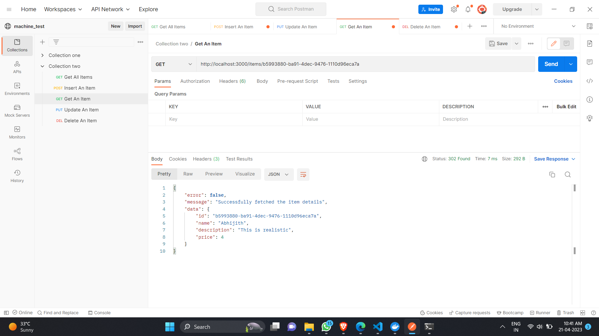
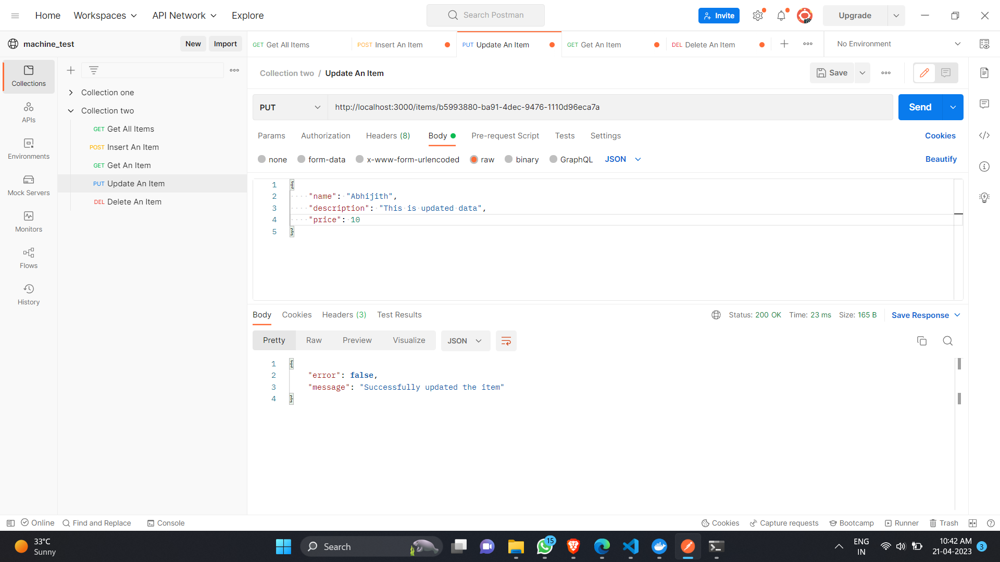
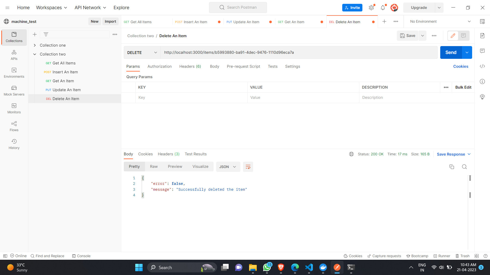

# Task - 4

Run the below command from <strong>task_4</strong> directory -  
`go run cmd/api/main.go`

 

Test routes in `localhost:3000`

 

You can also this postman api collection link to ease the process - 
[Postman API Collection Link](https://www.postman.com/abgth/workspace/machine-test/collection/20732200-97053ba0-f54a-4997-806a-5a7759a97ad0?action=share&creator=20732200)

## Outputs

### Inserting an item
- `localhost:3000/items` 
method = "POST"  

- `localhost:3000/items` 
method = "GET"  

- `localhost:3000/items/{id}` 
method = "GET"  

- `localhost:3000/items/{id}` 
method = "PUT"  

- `localhost:3000/items/{id}` 
method = "DELETE"  
