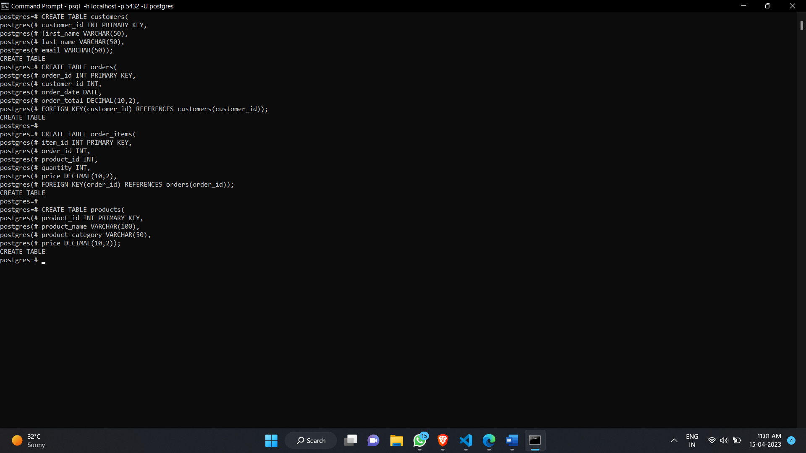
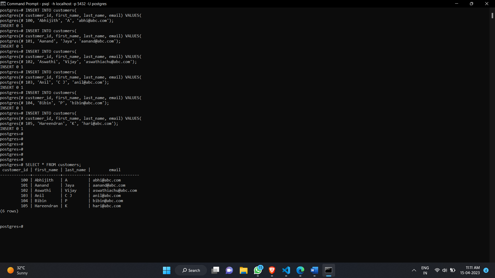
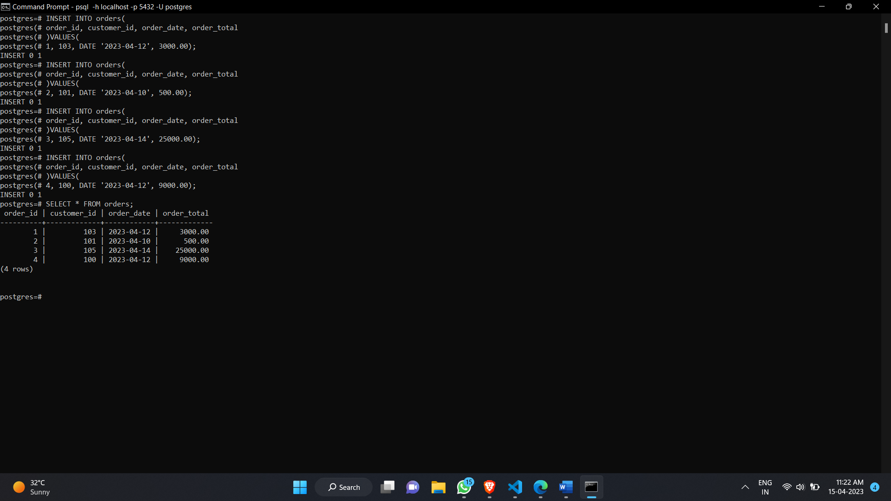
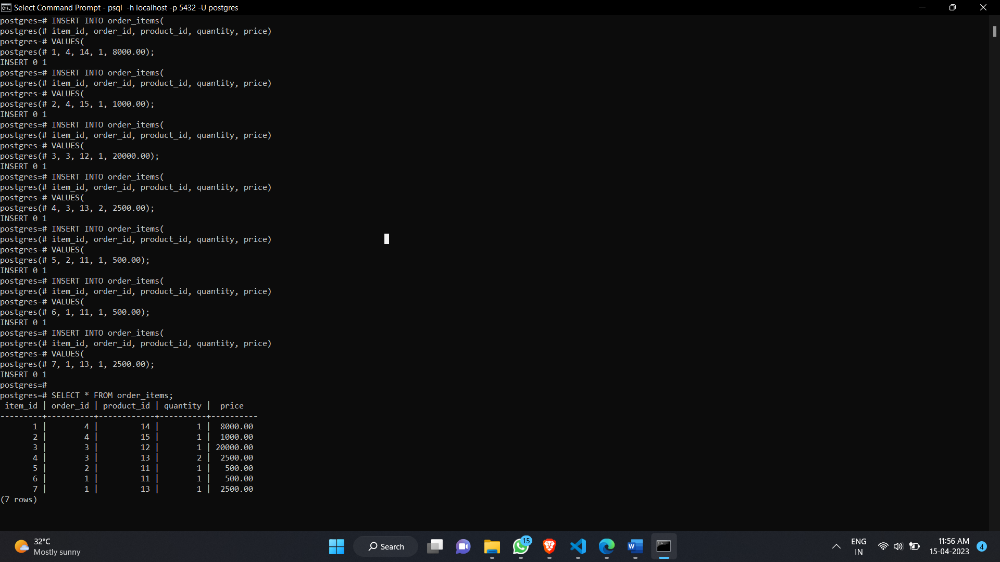
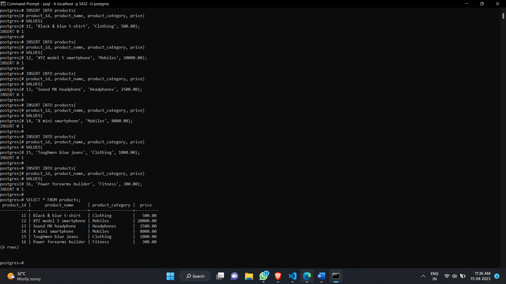
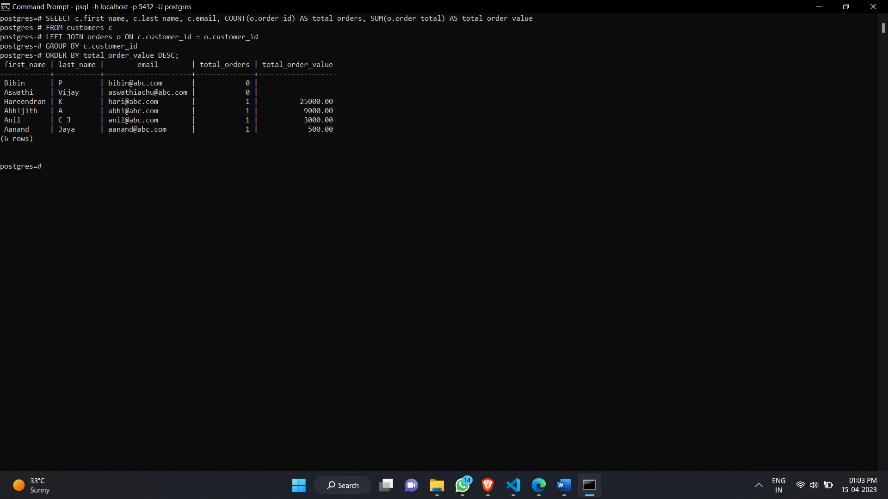

# Task - 5

## Outputs

- ### Creating all table

 

- ### Insert values to customer table

 

- ### Insert values to orders table

 

- ### Insert values to order items table

 

- ### Insert values to products table

 

- ### Final output 
